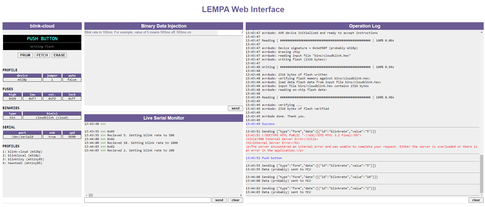

# LEMPA
**Standalone MCU programmer for RPi**

LEMPA is a combination of software and hardware to allow easy..ish programming of micro controllers such as Arduino (ATMega), ESP, and others directly from the PI with as little wire mess as possible.

### version 4 with OLED display coming up <a href="https://www.youtube.com/watch?v=MS-8_smsfuY">soon</a>
Click image for short video:


[](https://www.youtube.com/watch?v=8qee_lv31-o)

<!---->

LEMPA is composed of 3 parts:
### Hardware: Raspberry PI HAT
A custom PCB that contains all the relevant connections required to program:
* ATMega328 (including external oscillator)
* ATTiny
* ESP8266 
* Arduino mini pro
* Any other ATMega controller via connector

<a href="https://www.tindie.com/products/21205/"></a>

The board also includes:
* LEDs for visual status (ready, downloading, programing, success, and error)
* Jumper to define which profile to use.
* LED for testing 
* Program / download button. Short click to program the MCU, long click to download latest version of the BINs from cloud / local network / shared folder.


### Software
The software reads the different profiles and orchestrates the process of downloading new BINs and programming 

###### Installation instructions
1. Download the software and extract it
2. Install **avrdude** if needed `sudo apt-get install avrdude`
3. Install prequisites: `sudo apt-get install libopenjp2-7` and `sudo apt-get install libtiff5`
3. Install required libraries `pip3 install -r requirements.tx`
4. Make sure **profiles.json** reflects your environment
5. `python3 program.py` or `python3 program.py <profile id>`
6. Make sure you enable RPi interfaces: SPI, I2C, and Serial

#### Configuration: profiles.json
The configuration file can contain as many profiles as required.
```javascript
  {
    "id": "blinklocal",
    "type": "bin",
    "jumper" : 1,
    "device": "m328p",
    "programmer": "linuxspi",
    "bins": [
      {
        "method": "local",
        "name": "blinklocal"
      }
    ],
    "fuses": {
      "lfuse": "0xF7",
      "hfuse": "0xD6",
      "efuse": "0xFD",
      "lock": "0xFF"
    },
    "plugins": [
      {
        "name": "serialinjector",
        "conf": {
          "serialSpeed": 38400,
          "fields": [
            {
              "id": "blinkrate",
              "value": 5,
              "title": "Blink rate in 100ms. For exampe value of 5 means 500ms off, 500ms on",
              "type": "byte"
            }
          ]
        }
      }
    ]

  },
...
]
```
* **id** Unique ID for the profile 
* **type** `bin` or `composite`. Composite allows for multiple profile programming, one after another.
* **jumper** *optional* If specified, and the relevant profile is chosen with a physical jumper, this profile will be used if none was specified as part of command line parameter.
* **device** Type of device to program. Not required for ESP. See [AVRDude](https://www.nongnu.org/avrdude/user-manual/avrdude.html) for list of devices
* **bins** List of bins to upload. For ATMega only one bin is required. For ESP multiple bins can be specified to support SPIFFS
Bin method can be one of the following:

|method|description|requred fields|
|------|-----------|--------------|
|cloud |Fetch BIN from any URL|`url` - source of the BIN|
|cloud_gw |GW that will return info about the BIN. Usefull when a service is required in front of the BIN cloud storage|`info_url` - End point of the service that will retun information about the BIN. The response of this URL must be a valid JSON with  `url` field that points to the actual BIN|
|local |Don't fetch. Valid BIN must be under `bins` folder. System will not actively fetch anything |(none)|
|fs |File system copy|`src` - Path to source bin that needs to be copied|


* **plugins** System support a simple web server with the ability to send data to the ATMega via serial. This allows for parameter tweaking and QA. 

## Web Interface
It is possible to access the system via web UI that allows:
* Live view of system actions
* Full working 2 way serial monitor. ATMega328 is connected by default to RPi serial0. External boards can be connected via dedicated headers on the HAT
* Operation log
* System control
 

## Contact
Please contact me at roey@benamotz.com with any comments
